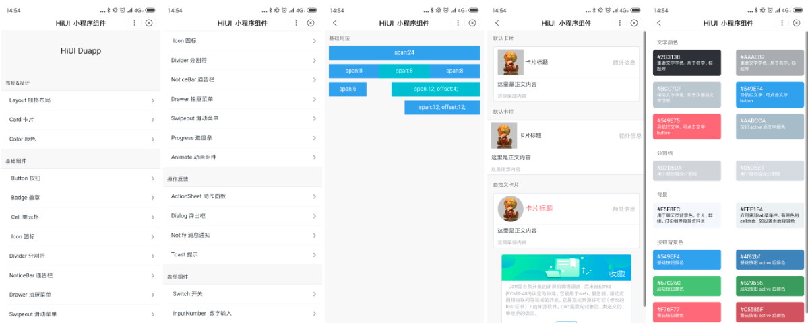

# HiUI  duapp   
### 智能小程序 UI 组件库   
## 如何使用  
下载 HiUI 的代码，将 `dist` 目录中的 `components` 文件夹拷贝到自己的项目中。然后按照如下的方式使用组件，例如使用Button 组件。  

1. 添加需要的组件，在页面的json中配置：  

```json   
"usingComponnts": {
    "i-button": "${your path}/components/button/index"
} 
```

2. 在 swan 中使用:  

```html 
<i-button type="primary">这是一个按钮</i-button> 
```  

其他组件的使用方式请参考对应文档。    

## 组件文档  
[https://caelumtian.github.io/hiui](https://caelumtian.github.io/hiui) 


## 组件效果预览    
在 dist 文件夹下的内容，是一个完整的智能小程序。里面包含了为您准备好的所有组件的预览 demo。您可以自行查看。  
由于当前智能小程序还不支持个人申请，为此没有线上项目来提供二维码。demo 截图如下：  


  
  
 


## 组件库开发初衷    
目前智能小程序还存在一定的问题：  

1. 功能上的缺失：例如 `Component` 构造器暂不支持 `relations`，`externalClasses` 等内容；
2. 框架本身存在一些功能逻辑 Bug，这里整理了一份组件库目前遇到的问题，供各位开发者参考。[智能小程序问题汇总](./doc/bug.md);    


为了解决这些问题，我们在基于本身业务的风格上开发了该组件库，也帮助他人开发的时候少走一些弯路。当然，有些问题不是通过编写组件库代码能解决的，这也导致了目前组件库还不能很好地支持部分组件的开发。可以暂时通过代码解决的都在组件文档上有说明（奇奇怪怪的代码）。我们也和官方提交了发现的问题，一但有更新，我们也会及时跟进和修改相应代码的。
 

## 更新日志 
### 10.19  
v0.0.1 发布    
### 11.05  
v0.0.2 发布  

修复智能小程序 properties 与实际表现不一致引起组件库部分 Boolean 属性缺失问题。  
[Bug 具体表现](https://github.com/CaelumTian/hiui/blob/master/docs/bug.md#%E7%BB%84%E4%BB%B6-properties-%E4%B8%8E%E5%AE%9E%E9%99%85%E8%A1%A8%E7%8E%B0%E4%B8%8D%E4%B8%80%E8%87%B4-%E5%B7%B2%E7%A1%AE%E8%AE%A410%E6%9C%8822%E5%8F%B7%E6%8F%90%E6%B5%8B%E4%BF%AE%E5%A4%8D)


