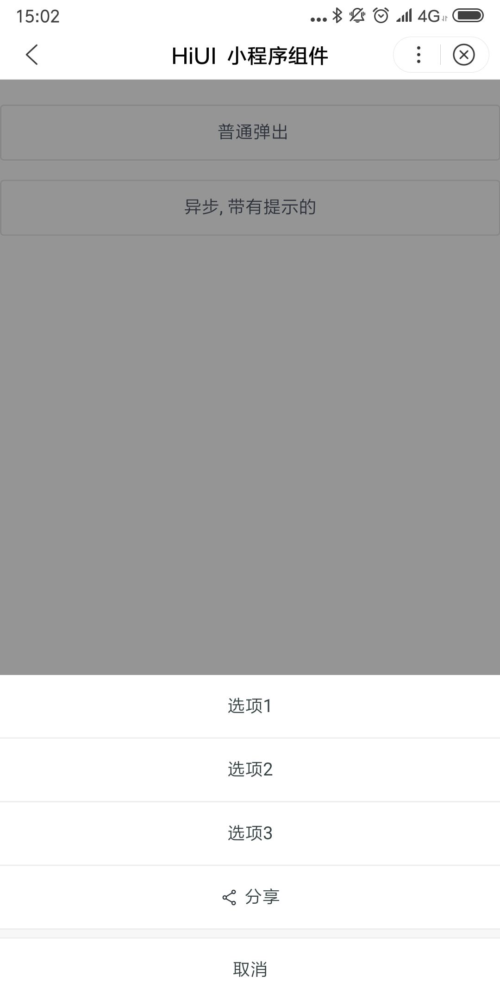

# ActionSheet 动作面板
## 使用指南  
在页面 json 中引入组件   

```json    
{
    "usingComponents": {
        "hi-card": "/components/action-sheet/index"
    }
} 
```

## 示例  
从底部弹出的模态框，支持提供标题和描述。需要传入一个actions的数组，数组的每一项是一个对象，对象属性见文档下方表格。

```html   
 <hi-action-sheet 
    actions="{{ actions }}" 
    show="{{ show }}"
    bind:cancel="handleCancel"
    bind:itemClick="handleItemClick"
    show-cancal="{{ false }}"></hi-action-sheet> 
```

```javascript 
Page({
    data: {
        actions: [
            {
                name: "选项1"
            },
            {
                name: "选项2"
            },
            {
                name: "选项3"
            },
            {
                name: "分享",
                openType: "share",
                icon: "share"
            }
        ]
        show: false,
    },
    handleClick() {
        this.setData({
            show: true
        })
    },
    handleCancel() {
        this.setData({
            show: false
        })
    },
    handleItemClick(event) {
        if(event.index === 3) {
            return false;
        }
        this.selectComponent("#message").show({
            "content": "选项 " + (event.index + 1),
            "type": "success"
        })
    }
}); 
```

## API  
### ActionSheet 属性  
| 属性 | 说明 | 类型 | 默认值 |
| --- | --- | --- | --- |
| ex-class | 根元素外部样式类名 | String | - |
| ex-mask-class | 自定义遮罩层样式名 | String | - |
| mask-closable | 点击遮罩层是否可以关闭组件 | Boolean | - |
| show-cancel | 是否显示取消按钮 | Boolean | false |
| cancel-text | 取消按钮文案 | String | 取消 |
| actions | 按钮组，具体项参照后面的表格 | Array | [] |

### ActionSheet actions  
| 属性 | 说明 | 类型 | 默认值 |
| --- | --- | --- | --- |
| name | 按钮文案 | String | - |
| icon | 按钮图标 | String | - |
| color | 按钮文字颜色 | String | - |
| loading | 按钮是否显示加载中 | Boolean | false |
| openType | 手百开放能力 | String` | - |

### ActionSheet events  
| 事件名 | 说明 | 返回值 |
| --- | --- | --- |
| bind:itemClik | 点击某个按钮时触发，返回按钮索引值 | index |
| bind:cancel | 点击关闭或遮罩层时触发 | - | 

### ActionSheet slot    
| 名称 | 说明 |
| --- | --- |  
| header | 标题栏 |  

## 演示


