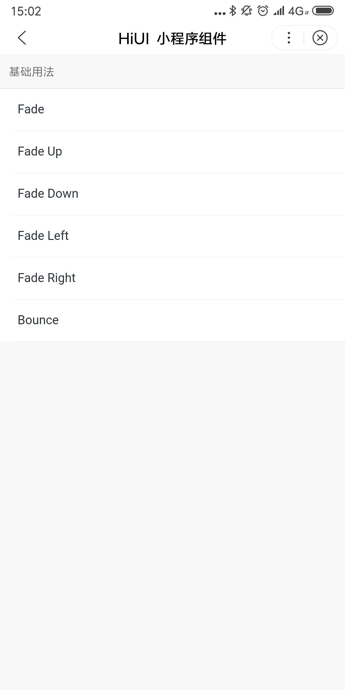

# Animate 动画组件  
## 使用指南  
在页面 json 中引入组件   

```json    
{
    "usingComponents": {
        "hi-animate": "/components/animate/index"
    }
} 
```

## 示例 
将元素包裹在 transition 组件内，在元素展示/隐藏时，会有相应的过渡动画 

```html  
<hi-animate show="{{ show }}" name="{{ name }}">
    内容...
</hi-animate>

<hi-cell-group border>
    <hi-cell title="Fade" bind:cellClick="handleFade"></hi-cell>
    <hi-cell title="Fade Up" bind:cellClick="handleFadeUp"></hi-cell>
</hi-cell-group>
```

```javascript  
let timer = null;
Page({
    data: {
        show: false,
    },
    handleFade() {
        this.handleAnimate('fade');
    },
    handleFadeUp() {
        this.handleAnimate('fade-up');
    },
    handleAnimate(name) {
        if(timer !== null) {
            return false;
        }
        this.setData({
            name,
            show: true
        });
        timer = setTimeout(() => {
            this.setData({
                show: false
            });
            timer = null;
        }, 1000)
    }
});  
```

## API
### Animate 属性  
| 属性 | 说明 | 类型 | 默认值 |
| --- | --- | --- | --- |
| name | 动画类型 | String | fade |
| show | 是否展示组件 | Boolean | false |
| duration | 动画时长，单位为毫秒 | Number | 300 | 

### 动画类型  
| 名称 | 说明 |
| --- | --- |
| fade | 淡入 |
| fade-up | 上滑淡入 |
| fade-down | 下滑淡入 |
| fade-left | 左滑淡入 |
| fade-right | 右滑淡入 |
| bounce | 弹跳淡入 | 

### 自定义动画说明  
* 显示元素动画样式类命名： `f-${你的动画名}-enter`
* 隐藏元素动画样式类命名：`f-${你的动画名}-leave`

## 演示

