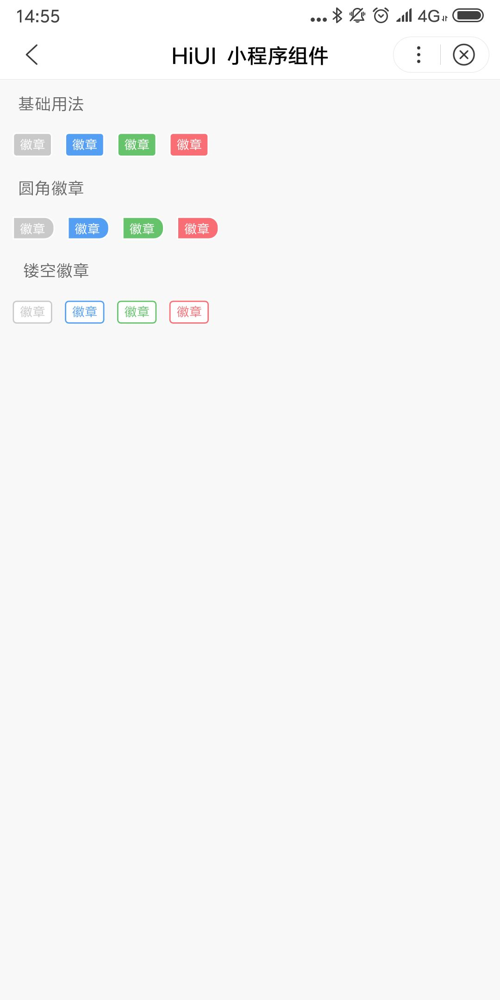

# Badge 徽章
## 使用指南  
在页面 json 中引入组件   

```json    
{
    "usingComponents": {
        "hi-badge": "/components/badge/index",
    }
} 
```

## 示例  

```html  
<hi-badge>徽章</hi-badge>
<hi-badge type="primary">徽章</hi-badge>
<hi-badge type="success" mark>徽章</hi-badge>
<hi-badge type="warning" plain>徽章</hi-badge>
```

## API  
### Badge 属性  

| 属性 | 说明 | 类型 | 默认值 |
| --- | --- | --- | --- |
| ex-class | 根元素外部样式类名 | String | - |
| type | 类型，可选值为primary, success, warning | String | - |
| plain | 是否为空心样式 | Boolean | false |
| mark | 是否为标记样式 | Boolean | false |

## 演示
