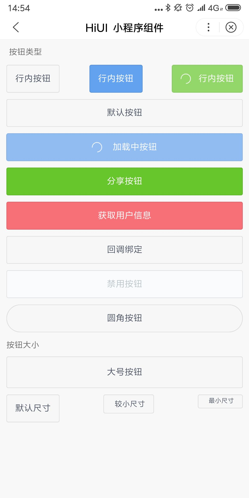

# Button 按钮  
## 使用指南  
在页面 json 中引入组件   

```json
{
    "usingComponents": {
        "hi-button": "/components/button/index"
    }
}
``` 

## 示例     
Button 基础组件, 在智能小程序已有的 `button` 组件上包装而成。

```html  
<hi-button>默认按钮</hi-button>
<hi-button inline>内联按钮</hi-button>
<hi-button shape="circle">圆角按钮</hi-button>
<hi-button size="small">较小尺寸</hi-button>
<hi-button size="mini">最小尺寸</hi-button>
<hi-button size="large">大号按钮</hi-button>
<hi-button loading type="primary">加载中按钮</hi-button>
<hi-button type="success" open-type="share">分享按钮</hi-button>
<hi-button type="warning" open-type="getUserInfo">获取用户信息</hi-button>
<hi-button bind:btnClick="handleClick">回调绑定</hi-button>
<hi-button disabled>禁用按钮</hi-button>
```

## API  
### 按钮属性  
| 属性 | 说明 | 类型 | 默认值 |
| --- | --- | --- | --- |
| ex-class | 根节点外部样式类 | String | - |
| type | 按钮类型，可选值为 default, primary, ghost, success, warning,或者不设置 | String | - |
| inline | 是否为行内元素，开启后宽度为自适应  | Boolean | - |
| size | 按钮大小，可选值为 mini, small, default, large | String | - |
| shape | 按钮形状，可选值 circle, square | String | square |
| disabled | 设置按钮禁用状态 | Boolean | false |
| loading | 设置按钮加载中状态 | Boolean | false |
| open-type | 手百开放能力，比如分享、获取用户信息等等 | String | - |
| hover-start-time | 按住后多久出现点击态，单位毫秒  | Number | 20 |
| hover-stay-time | 手指松开后点击态保留时间，单位毫秒 | Number | 70 |

### 按钮事件  

| 事件名 | 说明 | 返回值 |
| --- | --- | --- |
| bind:btnClick | 按钮点击回调 | - |
| bind:getuserinfo | 用户点击该按钮时，会返回获取到的用户信息，从返回参数的 detail 中获取到的值，和 swan.getUserInfo 一样的。和 open-type 搭配使用， 使用时机： open-type=”getUserInfo” | - |
| bind:getphonenumber | 获取用户手机号回调。和 open-type 搭配使用， 使用时机： open-type=”getPhoneNumber" | - |
| bind:opensetting | 在打开授权设置页后回调，使用时机：open-type="openSetting" | - |


## 演示
