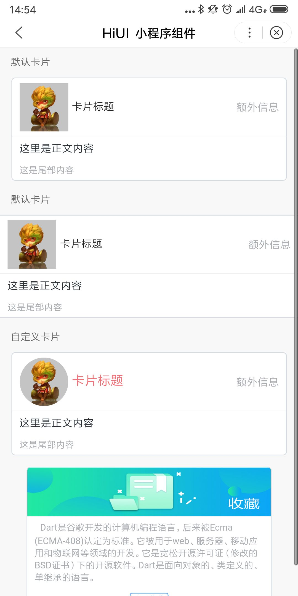

# Card 卡片  
## 使用指南  
在页面 json 中引入组件   

```json    
{
    "usingComponents": {
        "hi-card": "/components/card/index",
        "hi-badge": "/components/badge/index"
    }
} 
```

## 示例      
基础容器，用来显示文字、列表、图文等内容  

```html
<hi-card title="卡片标题" extra="额外信息" thumb="/images/avator.jpg">
    <view slot="content">这里是正文内容</view>
    <view slot="footer">这是尾部内容</view>
</hi-card>
```

## API  
### 卡片属性  
| 属性 | 说明 | 类型 | 默认值 |
| --- | --- | --- | --- |
| ex-class | 根节点外部样式类名 | String | - |
| ex-thumb-class | 缩略图自定义样式 | String | - |
| ex-header-class | 卡片标题行自定义样式 | String | - |
| ex-title-class | 卡片标题自定义样式 | String | - |
| full | 是否通栏 | Boolean<span class="Apple-tab-span" style="white-space:pre"></span> | - |
| title | 卡片标题 | String | - |
| extra | 额外内容 | String | - |
| thumb | 左侧缩略图 | String | - |

### 卡片 slot  

| 名称 | 说明 |
| --- | --- |
| contnet | 内容 |
| footer | 尾部内容 |  

## 演示



