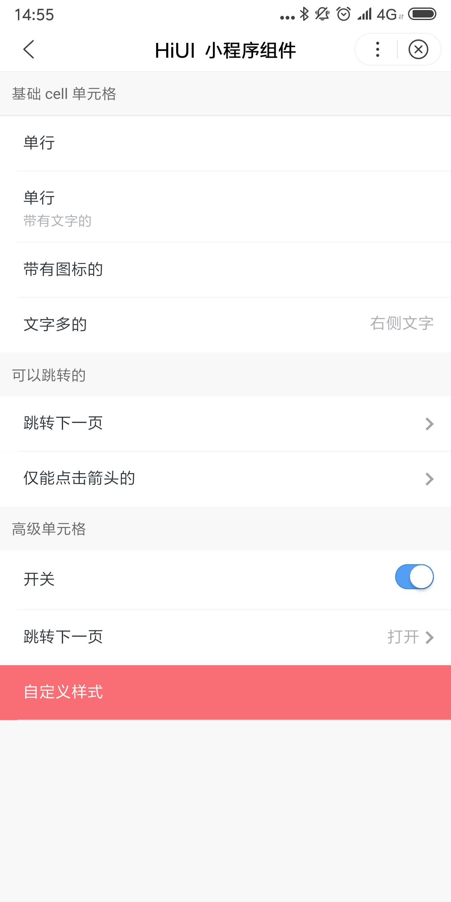

# Cell 单元格  
## 使用指南  
在页面 json 中引入组件   

```json    
{
    "usingComponents": {
        "hi-cell": "/components/cell/index",
        "hi-cell-group": "/components/cell-group/index"
    }
} 
```

## 示例  

```html  
<hi-cell-group border>
    <hi-cell title="单行" bind:cellClick="handleCellClick"></hi-cell>
    <hi-cell title="单行" label="带有文字的"></hi-cell>
    <hi-cell title="带有图标的">
        <hi-icon type="help"></hi-icon>
    </hi-cell>
    <hi-cell title="文字多的" value="右侧文字" lastcell></hi-cell>
    <hi-cell title="跳转下一页" link url="/pages/switch/index"></hi-cell>
    <hi-cell title="开关">
        <hi-switch 
            slot="right" 
            size="20px" 
            checked="{{ checked }}"
            bindchange="handleChange"></hi-switch>
    </hi-cell>
    <hi-cell title="自定义样式" ex-class="exbg" ex-title-class="white"></hi-cell>
</hi-cell-group>  
```

## API  
### Cell Group 属性  
| 属性 | 说明 | 类型 | 默认值 |
| --- | --- | --- | --- |
| ex-class | 根元素外部样式类名 | String | - |
| border | 是否显示外边框 | Boolean | true |

### Cell 属性    
| 属性 | 说明 | 类型 | 默认值 |
| --- | --- | --- | --- |
| ex-class | 根元素外部样式类名 | String | - |
| ex-title-class | cell 标题样式 | String | - |
| ex-label-class | cell 标题下方描述信息样式 | String | - |
| ex-right-class | cell 右侧节点样式 | String | - |
| title | 单元格左侧标题 | String | - |
| label | 标题下方的描述信息  | String | - |
| value | 右侧内容 | String | - |
| lastcell | 是否是最后一个元素 [注1] | Boolean | false |
| url | 跳转链接 | String | - |
| link-type | 链接跳转类型，可选值为 navigateTo, redirectTo, switchTab, reLaunch  | String | navigateTo |
| onlyTapRight | 只有点击 footer 区域才触发 tab 事件 | Boolean | false |
| link | 是否开启跳转 | Boolean | false | 

### Cell 事件  
| 事件名 | 说明 | 返回值 |
| --- | --- | --- |
| bind:cellClick | 点击 cell 时触发，onlyTapFooter 为 true 时点击 footer 区域触发 | - |  

### Cell slot  
| 名称 | 说明 |
| --- | --- |
| 默认 | 标题前自定义的 icon，可使用 icon 自定义组件，具体使用参考 icon 组件 |
| right | 右侧自定义内容，如果设置了 value 属性，则不生效 |

## 演示



