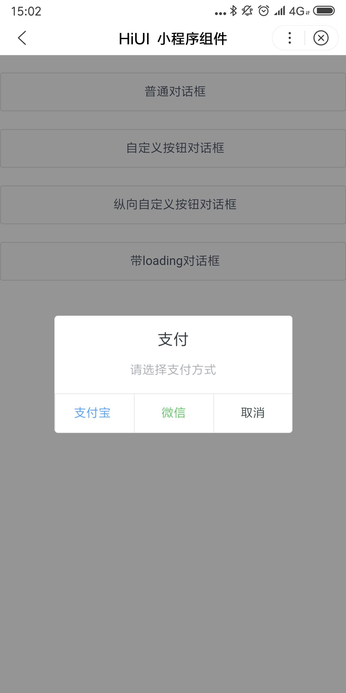

# Dialog 弹出框  
## 使用指南  
在页面 json 中引入组件   

```json    
{
    "usingComponents": {
        "hi-dialog": "/components/dialog/index"
    }
} 
``` 

## 示例  
模态对话框，在浮层中显示。  

```html    
<hi-button bind:btnClick="handleClick1">普通对话框</hi-button>
<hi-button bind:btnClick="handleClick2">自定义按钮对话框</hi-button> 

<hi-dialog 
    bind:cancel="handleCancel1" 
    bind:ok="handleOk1"
    show="{{ show1 }}" 
    title="普通对话框">
    我是对话框正文呦
</hi-dialog>
<hi-dialog 
    actions="{{ actions1 }}"
    bind:cancel="handleCancel2"
    bind:ok="handleOk2"
    show="{{ show2 }}"
    title="支付"
    bind:itemClick="itemClick1">请选择支付方式</hi-dialog>
```


```javascript 
Page({
    data: {
        show1: false,
        show2: false
        actions1: [
            {
                "name": "支付宝",
                "color": "#549ef4" 
            },
            {
                "name": "微信",
                "color": "#67c26c"
            },
            {
                "name": "取消"
            }
        ]
    },
    itemClick1(event) {
        let index = event.index;
        let text = '';
        switch(index) {
            case 0:
                text = "支付宝支付";
                break;
            case 1:
                text = "微信支付";
                break;
            case 2:
                text = "取消支付";
                break;   
        }
        this.selectComponent("#message").show({
            "content": text,
            "type": (index === 2 ? "warning" : "success")
        })
        this.setData({
            "show2": false
        })
    },
    handleClick1() {
        this.setData({
            show1: true,
            mode: "vertical"
        })
    },
    handleClick2() {
        this.setData({
            show2: true
        })
    }
}); 
```


## API  
### Dialog 属性  
| 属性 | 说明 | 类型 | 返回值 |
| --- | --- | --- | --- |
| show | 是否显示组件 | Boolean | false |
| title | 标题 | String | - |
| show-ok | 是否显示确定按钮 | Boolean | true |
| show-cancel | 是否显示取消按钮 | Boolean | true |
| ok-text | 确定按钮的文案 | String | 确定 |
| cancel-text | 取消按钮的文案 | String | 取消 |
| actions | 按钮组，具体项参照后面的表格 | Array | [] |
| mode | 按钮的排列方向，可选值为 horizontal 或 vertical | String | horizontal |

### Dialog actions  
| 属性 | 说明 | 类型 | 返回值 |
| --- | --- | --- | --- |
| name | 按钮文案 | String | - |
| title | 标题 | String | - |
| show-ok | 是否显示确定按钮 | Boolean | true |
| show-cancel | 是否显示取消按钮 | Boolean | true |


### Dialog events  
| 事件名 | 说明 | 返回值 |
| --- | --- | --- |
| bind:ok | 点击确定按钮时触发 | - |
| bind:cancel | 点击取消按钮时触发 | - |
| bind:itemClick | 点击某按钮组时触发，返回按钮在 actions 中索引 | index |

## 演示

