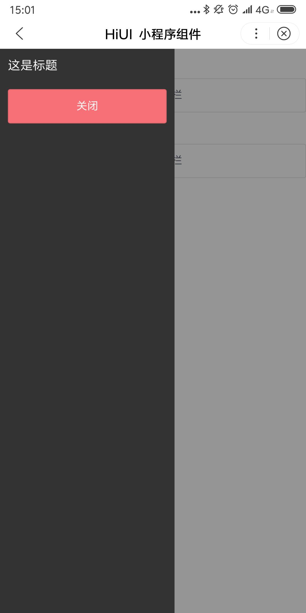

# Drawer 抽屉菜单  
## 使用指南  
在页面 json 中引入组件   

```json    
{
    "usingComponents": {
        "hi-drawer": "/components/drawer/index",
    }
} 
```  

## 示例  
```html 
<hi-button bind:btnClick="handleClick">打开侧边栏</hi-button>  
<hi-drawer show="{{ show }}" bind:close="handleClose">
    <view class="content">
        <view class="head">
            这是标题
        </view>
        <hi-button bind:btnClick="handleClose" type="warning">关闭</hi-button>
    </view>
</hi-drawer> 
```  

```javascript  
Page({
    data: {
        show: false
    },
    handleClick() {
        this.setData({
            show: true
        })
    },
    handleClose() {
        this.setData({
            show: false
        })
    }
})
```  

## API 
### Drawer 属性  
| 属性 | 说明 | 说明 | 默认值 |
| --- | --- | --- | --- |
| ex-class | 根元素外部类样式名 | String | - |
| show | 是否显示组件 | Boolean | false |
| direction | 显示位置，可选值为 left 和 right | String | left |
| width | 弹出框宽度 | String | 224px |
| mask | 是否显示遮罩层 | Boolean | true |
| mask-closeable | 是否允许点击遮罩层关闭 | Boolean | true |  

### Drawer events  
| 事件名 | 说明 | 返回值 |
| --- | --- | --- |
| bind:close |关闭时触发 | - |

## 演示


