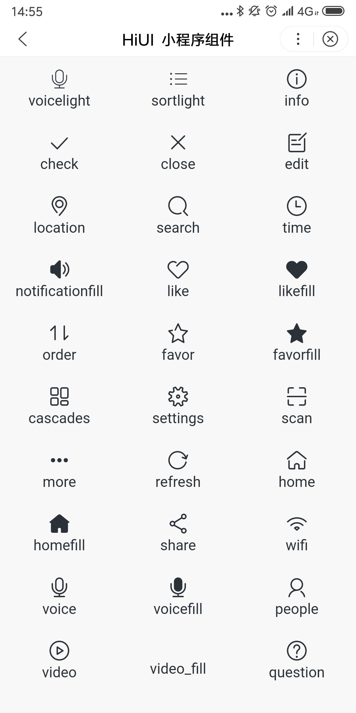

# Icon 图标  
## 使用指南  
在页面 json 中引入组件   

```json    
{
    "usingComponents": {
        "hi-icon": "/components/icon/index"
    }
} 
```     

## 示例  
```html 
<hi-icon type="search" size="25px"></hi-icon> 
```

## API  
### Icon 属性  
| 属性 | 说明 | 类型 | 默认值 |
| --- | --- | --- | --- |
| ex-class | 根节点外部样式类名 | String | - |
| size | 字体图标大小 | String | 16px |
| color | 字体图标颜色 | String | #2b3138 |  

## 演示


