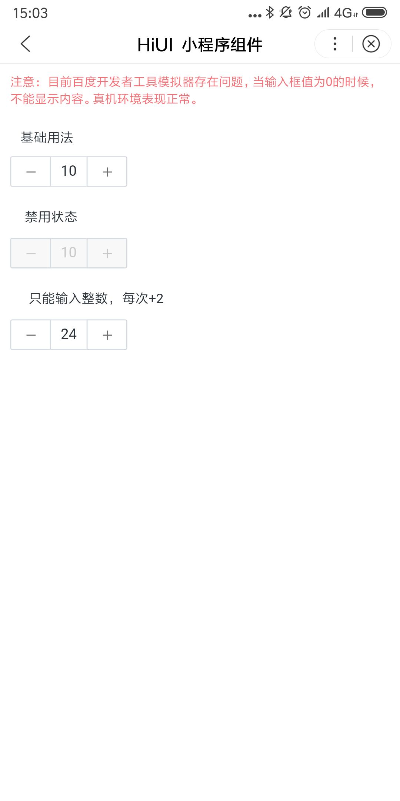

# InputNumber 数字输入  
## 使用指南  
在页面 json 中引入组件   

```json    
{
    "usingComponents": {
        "hi-notify": "/components/input-number/index"
    }
} 
```

## 示例  

```html 
<hi-input-number value="{{ 10 }}" disabled/> 
<hi-input-number value="{{ 24 }}" step="2"/>
```

## API
### InputNumber 属性  
| 属性 | 说明 | 类型 | 默认值 |
| --- | --- | --- | --- |
| ex-class | 根元素外部类样式 | String | - |
| value | 当前值 | Number | - |
| max | 最大值 | Number | Number.MAX_SAFE_INTEGER |
| min | 最小值 | Number | 0 |
| step | 每次改变的步伐，可以是小数 | Number | 1 |

### InputNumber events  
| 事件名 | 说明 | 返回值 |
| --- | --- | --- |
| bind:ichange | 当绑定值变化时触发的事件 | {newValue} |

## 演示
