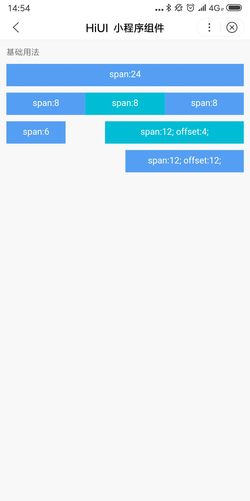

# Layout 栅格  
## 使用指南  
在页面 json 中引入组件   

```json
{
    "usingComponents": {
        "hi-col": "/components/col/index",
        "hi-row": "/components/row/index"
    }  
}
``` 
 
## 示例  
Layout 组件采用了24列栅格，通过在`Col`上添加`span`属性设置列所占宽度。通过添加`offset`属性设置列的偏移宽度。  

```html  
<hi-row ex-class="wrap">
    <hi-col ex-class="bg" span="6">
        <view class="des">span:6</view>
    </hi-col>
    <hi-col ex-class="bg" span="14" offset="4">
        <view class="des">span:12; offset:4;</view>
    </hi-col>
</hi-row> 
```  

## API

### Col  
| 参数 | 说明 | 类型 | 默认值 |
| --- | --- | --- | --- |
| span | 列元素宽度 | String|Number | - |
| offset | 列元素偏移距离 | String|Number | - |

### 外部样式类     
| 类名 | 说明 |
| --- | --- |
| ex-class | 根节点样式类 |  

## 演示  



