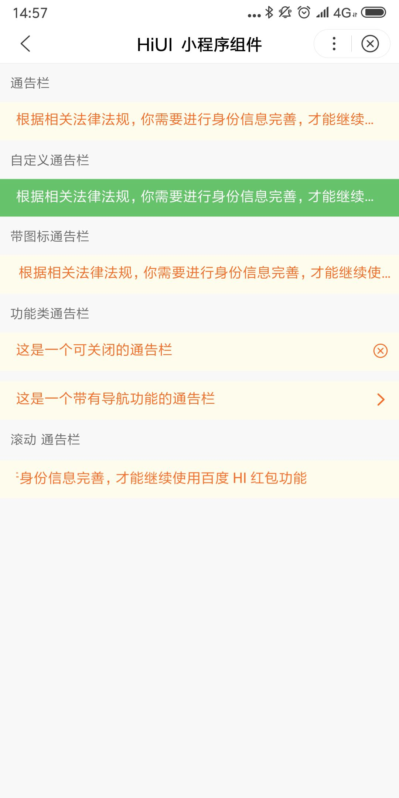

# NoticeBar 通告栏  
## 使用指南  
在页面 json 中引入组件   

```json    
{
    "usingComponents": {
        "hi-noticebar": "/components/notice-bar/index"
    }
} 
```    

## 示例 
```html   
普通公告栏 
<hi-notice-bar>
    根据相关法律法规，你需要进行身份信息完善，才能继续使用百度 HI 红包功能
</hi-notice-bar> 

带图标公告栏
<hi-notice-bar icon="notification">
    根据相关法律法规，你需要进行身份信息完善，才能继续使用百度 HI 红包功能
</hi-notice-bar>

带功能的公告栏
<hi-notice-bar mode="link" url="/pages/index/index">
    这是一个带有导航功能的通告栏
</hi-notice-bar>

文字滚动公告栏
<hi-notice-bar loop>
    根据相关法律法规，你需要进行身份信息完善，才能继续使用百度 HI 红包功能
</hi-notice-bar>
```

## API 
### NoticeBar 属性    
| 属性 | 说明 | 类型 | 默认值 |
| --- | --- | --- | --- |
| ex-class | 根元素外部样式类名 | String | - |
| mode | 通告栏模式，可选值为 closeable link | String | - |
| loop | 文字是否滚动显示 | Boolean | false |
| speed | 滚动速度 | Number | 1000 |
| color | 文字颜色 | String | #f76a24 |
| background-color | 背景色 | String | - |
| open-type | 智能小程序开放能力（mode 为 link 时有效） | String | navigator |
| url | navigator 组件 url | String` | - |  


## 演示

 

