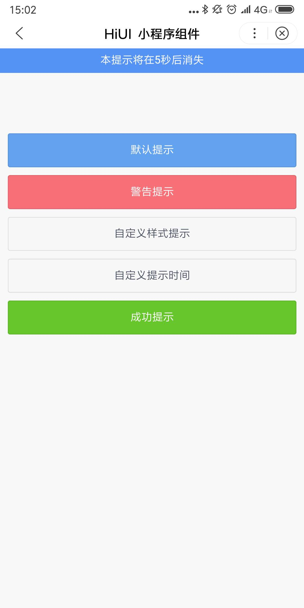

# Notify 消息通知  
## 使用指南  
在页面 json 中引入组件   

```json    
{
    "usingComponents": {
        "hi-notify": "/components/notify/index"
    }
} 
```

## 示例  
轻量级的信息反馈组件，在顶部居中显示，并自动消失  

```html
<hi-button bind:btnClick="handlePrimary" type="primary">默认提示</hi-button>
<hi-button bind:btnClick="handleSuccess" type="success">成功提示</hi-button>
<hi-button bind:btnClick="handleCustom">自定义样式提示</hi-button>
<hi-button bind:btnClick="handleCustomTime">自定义提示时间</hi-button>

<hi-notify id="message"/>
```

```javascript  
Page({
    handlePrimary() {
        this.selectComponent("#message").show({
            "content": "这是一个默认提示"
        })
    },
    handleSuccess() {
        this.selectComponent("#message").show({
            "content": "这是一个成功提示",
            "type": "success"
        })
    },
    handleCustom() {
        this.selectComponent("#message").show({
            "content": "自定义样式提示框",
            "exClass": "custom-message"
        })
    },
    handleCustomTime() {
        this.selectComponent("#message").show({
            "content": "本提示将在5秒后消失",
            "duration": 5000
        })
    }
});
```

## API 
### Notify 属性 
| 属性 | 说明 | 类型 | 默认值 |
| --- | --- | --- | --- |
| ex-class | 根元素外部类样式 | String | - |
| content | 内容 | String | - |
| type | 类型，可选值为 default、success、warning | String | default |
| duration | 持续时间，单位毫秒，设置为 0 则不自动关闭;可手动关闭，$(Notify).hide() | Number | 2000 | 

## 演示

