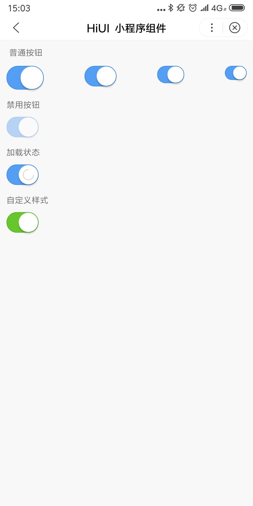

# Switch 开关  
## 使用指南  
在页面 json 中引入组件   

```json    
{
    "usingComponents": {
        "hi-switch": "/components/switch/index"
    }
} 
```


## 示例 
较小程序提供的switch，多了自定义样式，自定义大小，loading等功能

```html 
普通按钮
<hi-switch 
    checked="{{ checked }}" 
    bindchange="handleChange"
    size="35px"></hi-switch>

带loading按钮
<hi-switch checked="true" loading></hi-switch>

自定义样式
<hi-switch checked="true" ex-class="exbg"></hi-switch>
```

```javascript
Page({
    data: {
        checked: true
    },
    handleChange: function(event) {
        this.setData({
            checked: event.value
        })
    }
});
```

## API
### Switch 属性  
| 属性 | 说明 | 类型 | 返回值 |
| --- | --- | --- | --- |
| ex-class | 根元素外部类名 | String | - |
| checked | 是否被选中 | Boolean | false |
| size | 按钮大小 | String | 30px |
| loading | 是否显示加载中状态 | Boolean | false |
| disabled | 是否禁用 | Boolean | false |


## 演示

