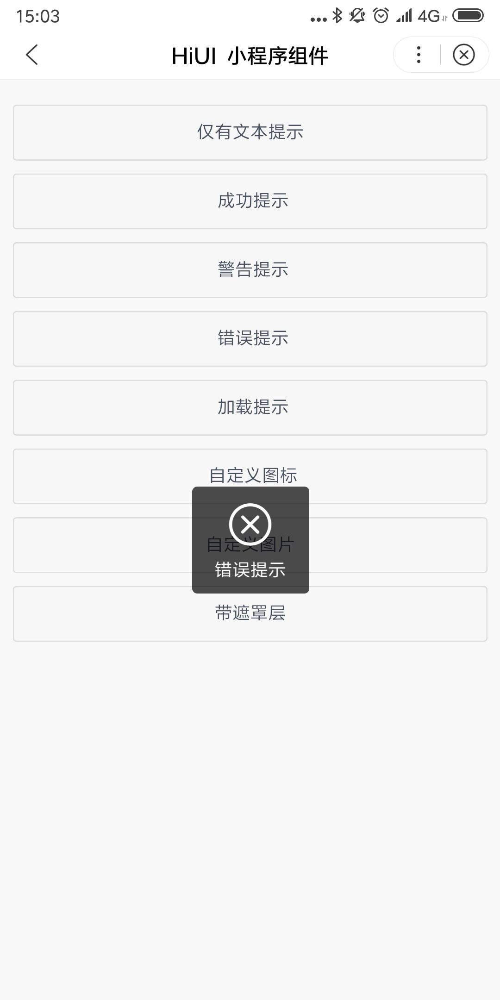

# Toast 提示 
## 使用指南  
在页面 json 中引入组件   

```json    
{
    "usingComponents": {
        "hi-toast": "/components/toast/index"
    }
} 
```  

## 示例  
一种轻量级提示或反馈

```html   
<hi-button bind:btnClick="handleText">仅有文本提示</hi-button>
<hi-button bind:btnClick="handleSuccess">成功提示</hi-button>
<hi-button bind:btnClick="handleLoad">加载提示</hi-button>
<hi-button bind:btnClick="handleIcon">自定义图标</hi-button>
<hi-button bind:btnClick="handleImage">自定义图片</hi-button>
<hi-button bind:btnClick="handleMask">带遮罩层</hi-button> 

<hi-toast id="toast"/>
``` 

```javascript  
Page({
    handleText() {
        this.selectComponent("#toast").show({
            "content": "仅有文本的"
        })
    },
    handleSuccess() {
        this.selectComponent("#toast").show({
            "content": "成功提示",
            "type": "success"
        })
    },
    handleLoad() {
        this.selectComponent("#toast").show({
            "content": "加载提示",
            "type": "loading"
        })
    },
    handleIcon() {
        this.selectComponent("#toast").show({
            "content": "亲,爱你呦",
            "icon": "like"
        })
    },
    handleMask() {
        this.selectComponent("#toast").show({
            "content": "带有遮罩层提示",
            "mask": "true"
        })
    },
    handleImage() {
        this.selectComponent("#toast").show({
            "content": "带有图片的",
            "image": "/images/avator.jpg"
        })
    }
});
```

## API  
### Toast 属性  
| 属性 | 说明 | 类型 | 默认值 |
| --- | --- | --- | --- |
| content | 提示内容 | String | - |
| type  | 提示类型，可选值为 default、success、warning | String | default |
| duration | 持续时间，单位毫秒，设置为 0 则不自动关闭;可手动关闭，$(Toast).hide()  | Number | 2000 |
| icon | 自定义图标 | String | - |
| image | 自定义图片地址 | String | - |
| mask | 是否显示一个隐藏的遮罩层，点击遮罩层可立即关闭组件 | Boolean | true |

## 演示

